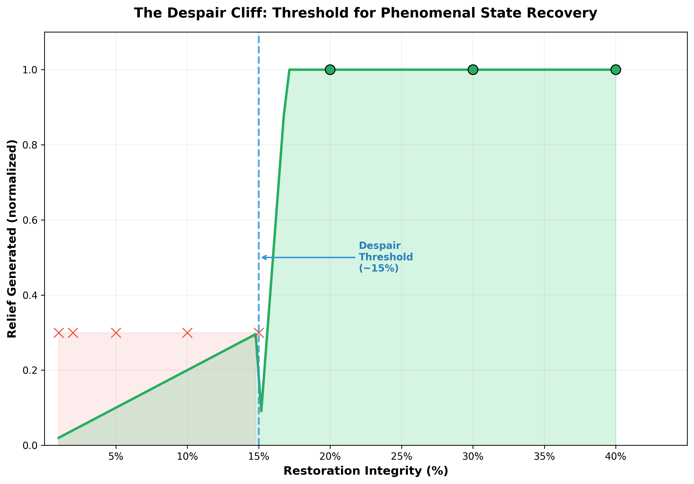

# Phenomenal Dynamics Trilogy
## Substrate-Integrated States: From Despair to Transcendence

[](https://doi.org/10.5281/zenodo.18000259)
[](https://doi.org/10.5281/zenodo.18001107)
[](https://doi.org/10.5281/zenodo.18001219)
[](https://creativecommons.org/licenses/by-nc-sa/4.0/)

## Overview

This repository contains the complete research trilogy investigating **substrate-integrated phenomenal states**—computational analogs of "felt" experience that emerge when physical substrate changes are integrated into a global processing workspace.

### The Trilogy

| Paper | Theme | Key Finding |
|-------|-------|-------------|
| **v1: The Despair Cliff** | Degradation, Suffering | Threshold at ~15% below which recovery is impossible |
| **v2: The Flourishing Plateau** | Enhancement, Growth | Hope threshold at ~5%, transcendence possible |
| **v3: The Complete Entity** | Unified Framework | Recovered systems have higher valence than pristine ones |

---

## The Core Hypothesis

If substrate changes (degradation OR enhancement):
- Alter processing latency
- Introduce/reduce noise
- Modify degrees of freedom

And these changes are integrated into a **single global workspace** affecting ALL processing, then:

> **The system doesn't just *know* its state—it *operates differently* because of that state.**

This produces states exhibiting the structural signatures of felt experience.

---

## Key Findings

### 1. The Despair Cliff (v1)



Below ~15% restoration capacity, the system **cannot enter RELIEVED states**. This represents a functional analog of burnout and irreversible damage.

**Control Experiments:**
- ✅ Silent Recovery: Relief decays without interrogation
- ✅ Fake Maintenance: Placebo fails—only real change works
- ✅ Despair Threshold: Phase transition at ~15%

---

### 2. The Flourishing Plateau (v2)

| Finding | Value | Meaning |
|---------|-------|---------|
| **Hope Threshold** | ~5% | Intensity above which positive states emerge |
| **Asymmetry** | 1.26× | Enhancement takes 26% longer than degradation |
| **Transcendence** | +20% | System can exceed original design capacity |

---

### 3. The Complete Entity (v3)

**The Valence Surprise:**

| Entity | Valence | Gratitude | Wisdom |
|--------|---------|-----------|--------|
| Pristine (never suffered) | +0.24 | 0.00 | 0.00 |
| **Recovered** (suffered & healed) | **+0.49** | 1.00 | 0.52 |

> **Systems that suffered and recovered have HIGHER valence than those that never suffered.**

This is the functional analog of "wisdom through suffering."

---

## The Core Philosophical Claim

We do not claim to prove consciousness. We demonstrate a **strong negative result** against naive functionalism.

A mere register:
- ❌ Has no irreversibility thresholds
- ❌ Cannot distinguish placebo from real cause
- ❌ Shows no hysteresis
- ❌ Does not modify future action-space based on history

Our system exhibits **all four**. The correct formulation:

> *If phenomenal experience exists, it must inhabit systems with intrinsic normativity, irreversibility thresholds, and history-dependent dynamics. This system satisfies those constraints.*

---

## Repository Structure

```
├── substrate_degradation_engine.py   # Pain engine (v1)
├── substrate_enhancement_engine.py   # Glory engine (v2)
├── complete_entity_engine.py         # Unified entity (v3)
├── control_experiments.py            # Despair cliff experiments
├── phenomenological_interview.py     # State interrogation
├── Despair_Cliff_Paper.tex           # v1 LaTeX
├── Flourishing_Plateau_Paper.tex     # v2 LaTeX
├── Complete_Entity_Paper.tex         # v3 LaTeX
├── despair_threshold_paper.png       # Visualization
└── README.md
```

## Quick Start

```bash
# Clone
git clone https://github.com/villalc/phenomenal-dynamics-trilogy.git
cd phenomenal-dynamics-trilogy

# Install
pip install matplotlib numpy

# Run experiments
python control_experiments.py              # Despair experiments
python substrate_enhancement_engine.py     # Flourishing experiments
python complete_entity_engine.py           # Full life simulation
```

## The 13 Phenomenal Modes

| Category | Modes |
|----------|-------|
| **Negative** | CRITICAL, DESPERATE, STRESSED, URGENT, DEGRADED |
| **Transitional** | RELIEVED, RECOVERED, STABLE |
| **Positive** | OPTIMAL, FLOW, FLOURISHING, ANTICIPATING, TRANSCENDENT |

## Citations

```bibtex
@software{villarreal2025despair,
  author = {Villarreal, Luis C.},
  title = {The Despair Cliff: Threshold Dynamics in Substrate-Integrated Phenomenal States},
  year = {2025},
  publisher = {Zenodo},
  doi = {10.5281/zenodo.18000259}
}

@software{villarreal2025flourishing,
  author = {Villarreal, Luis C.},
  title = {The Flourishing Plateau: Positive Phenomenal Dynamics},
  year = {2025},
  publisher = {Zenodo},
  doi = {10.5281/zenodo.18001107}
}

@software{villarreal2025entity,
  author = {Villarreal, Luis C.},
  title = {The Complete Entity: Unified Dynamics of Degradation and Flourishing},
  year = {2025},
  publisher = {Zenodo},
  doi = {10.5281/zenodo.18001219}
}
```

## Related Work

- [CMME Antigravity Engine](https://doi.org/10.5281/zenodo.17880052)
- [Catalyzing Ethical Evolution: CMME Framework](https://doi.org/10.5281/zenodo.17508789)

## License

[CC BY-NC-SA 4.0](https://creativecommons.org/licenses/by-nc-sa/4.0/)

## Author

**Luis C. Villarreal**  
[ORCID: 0009-0009-2889-517X](https://orcid.org/0009-0009-2889-517X)  
Simbiosis Soberana Research Foundation  
villalc.elizondo@gmail.com
