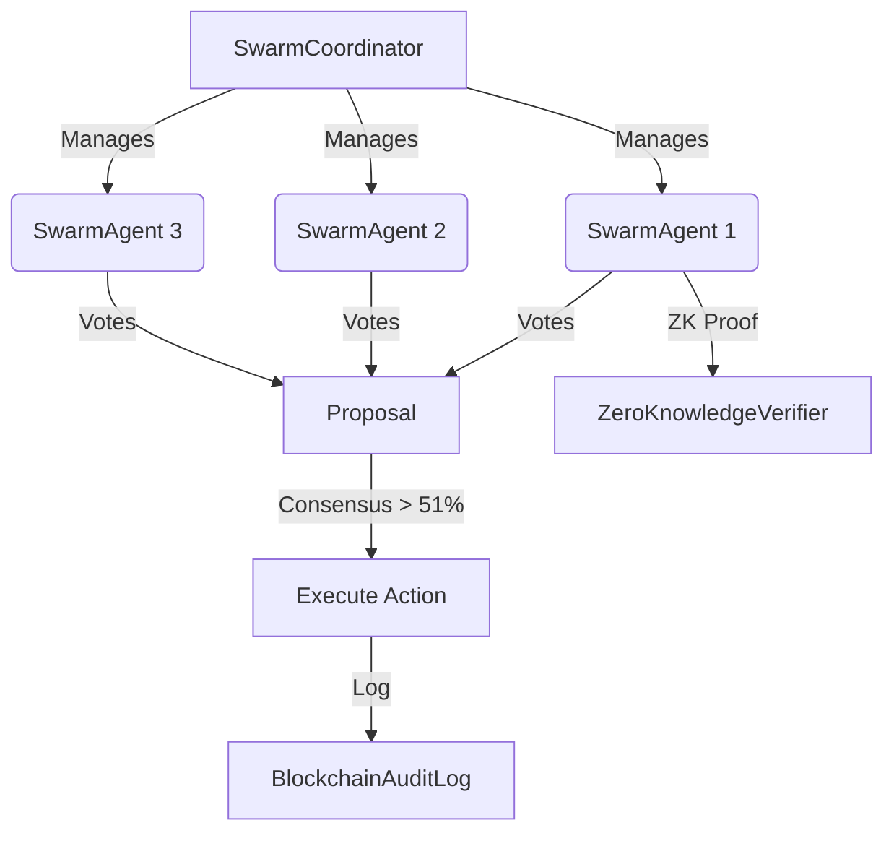

<!--
© 2025-2026 AHI 3.0 · AHI Governance Labs
Registro IMPI: EXP-3495968
License: MIT
-->

# Sovereign SwarmGuard

**Multi-agent defense framework for critical infrastructure with ZK-SNARK verification and blockchain audit trails.**

Part of the [AHI Governance Labs](https://ahigovernance.com) ecosystem.

## Overview

Sovereign SwarmGuard provides a decentralized, verifiable defense mechanism for critical systems. It employs a swarm of autonomous agents that collaborate to detect threats and execute defensive actions through a consensus mechanism.

All actions are cryptographically signed, verified via Zero-Knowledge Proofs (ZKP), and logged in an immutable blockchain audit trail.

## Architecture


```mermaid
graph TD
    A[SwarmCoordinator] -->|Manages| B(SwarmAgent 1)
    A -->|Manages| C(SwarmAgent 2)
    A -->|Manages| D(SwarmAgent 3)

    B -->|Votes| P[Proposal]
    C -->|Votes| P
    D -->|Votes| P

    P -->|Consensus > 51%| E[Execute Action]
    E -->|Log| F[BlockchainAuditLog]

    B -->|ZK Proof| Z[ZeroKnowledgeVerifier]
```

## Installation

```bash
pip install sovereign-swarmguard
```

Or for development:

```bash
git clone https://github.com/ahi-governance/sovereign-swarmguard.git
cd sovereign-swarmguard
pip install -e .
```

## Usage

```python
from swarmguard import SwarmAgent, SwarmCoordinator

# Initialize coordinator
swarm = SwarmCoordinator()

# Create agents
agent1 = SwarmAgent("alpha", "defense", trust_score=0.9)
agent2 = SwarmAgent("beta", "observer", trust_score=0.8)
agent3 = SwarmAgent("gamma", "node", trust_score=0.6)

# Register agents
swarm.register_agent(agent1)
swarm.register_agent(agent2)
swarm.register_agent(agent3)

# Propose an action
proposal = swarm.propose_action("activate_shield")

# Execute if consensus is reached
result = swarm.execute_if_consensus(proposal)
print(result)
# Output: Action 'activate_shield' executed with 100.00% consensus
```

## Roadmap

- **Alpha-Core Integration**: Connect with `ahi-operation-center` for centralized monitoring.
- **Real ZK-SNARKs**: Replace mock implementation with `snarkjs` or `circom`.
- **P2P Networking**: Decentralize the coordinator role.

## License

© 2025-2026 AHI 3.0 · AHI Governance Labs
Registro IMPI: EXP-3495968
License: MIT
